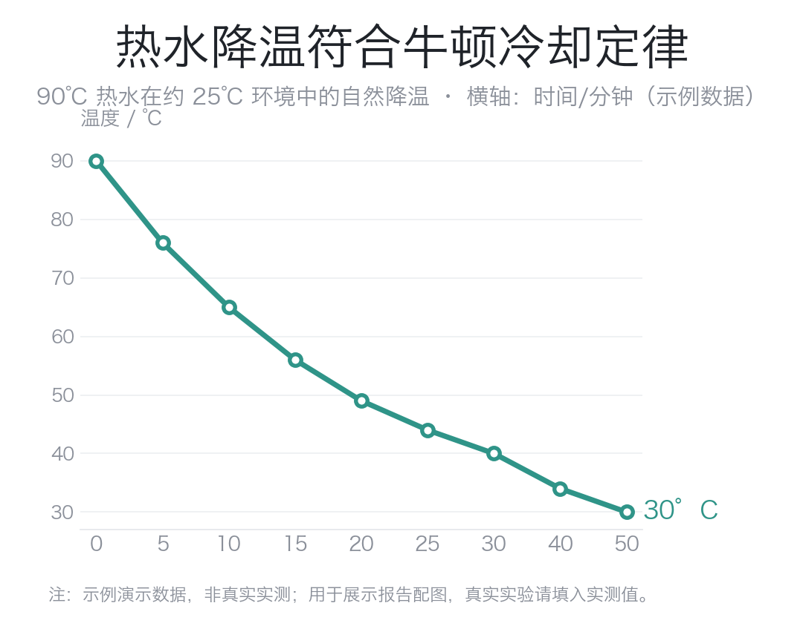

# 牛顿冷却定律的验证——热水自然降温实验报告

> 课程：大学物理实验　|　姓名：＿＿＿　学号：＿＿＿　日期：＿＿＿
> （演示文档：数据为示例，真实实验请填入实测值）

## 摘要

为验证牛顿冷却定律，本实验记录一杯 90 ℃ 热水在约 25 ℃ 室温下的自然降温过程，
每隔一段时间读取水温。结果显示水温随时间呈**指数衰减**，且 ln(T−T_环境) 与时间
近似线性，斜率对应冷却常数 k≈0.05 min⁻¹，与牛顿冷却定律的预言一致。误差主要来自
环境温度波动与读数时刻误差。

## 一、实验目的

1. 观测热物体在恒温环境中的自然降温规律；
2. 验证牛顿冷却定律，并由数据求出冷却常数 k。

## 二、实验原理

牛顿冷却定律指出：物体温度下降的速率与它跟环境的温差成正比。设物体温度为 T、
环境温度为 T_env，则

　　dT/dt = −k (T − T_env)

积分得温度随时间的解：

　　T(t) = T_env + (T₀ − T_env) · e^(−kt)

即温差按指数衰减。为便于**线性化验证**，两边取自然对数：

　　ln(T − T_env) = ln(T₀ − T_env) − k·t

因此以 ln(T−T_env) 为纵轴、t 为横轴作图应得一条直线，斜率的绝对值即冷却常数 k。
这是本实验判定"是否符合定律"的核心判据。

## 三、实验材料与方法

- **材料**：烧杯、温度计（量程 0–100 ℃，最小刻度 1 ℃）、秒表、约 90 ℃ 热水、室温环境。
- **步骤**：
  1. 记录环境温度 T_env（本次约 25 ℃）；
  2. 将 90 ℃ 热水倒入烧杯，温度计悬于水中央，不接触杯壁与杯底；
  3. 从 t=0 起，按 0、5、10、15、20、25、30、40、50 min 读取并记录水温；
  4. 每次读数视线与液柱刻度齐平，减小视差。

## 四、实验结果

实测数据如表 1、图 1（**以下为示例演示数据**）。

**表 1　水温随时间变化（示例数据）**

| 时间 t / min | 0 | 5 | 10 | 15 | 20 | 25 | 30 | 40 | 50 |
|---|---|---|---|---|---|---|---|---|---|
| 水温 T / ℃ | 90 | 76 | 65 | 56 | 49 | 44 | 40 | 34 | 30 |
| T−T_env / ℃ | 65 | 51 | 40 | 31 | 24 | 19 | 15 | 9 | 5 |

如图 1，水温从 90 ℃ 快速下降后趋缓，曲线形态与指数衰减一致。对 T−T_env 取对数后
作线性拟合，斜率约为 −0.051 min⁻¹，即 **k≈0.05 min⁻¹**，各点基本落在同一直线上。

## 五、分析与讨论

**是否符合定律。** 降温初期温差大、下降快，后期温差小、趋于平缓，符合"速率正比于
温差"的预言；半对数线性化后近似成直线，进一步支持指数衰减模型。可以认为本实验数据
与牛顿冷却定律一致。

**误差来源。**
- **环境温度并非严格恒定**：室温在实验中有小幅波动，而模型假设 T_env 恒定；
- **读数时刻与视差误差**：秒表与温度计读取存在人为延迟和视线偏差；
- **散热条件简化**：牛顿冷却定律在温差不太大时才近似成立，且忽略了蒸发散热的影响，
  高温段蒸发较强可能使实际降温略快于纯传导模型。

**局限。** 单次实验、单一初温，未做重复测量与不同初温对照，k 值的普适性有待更多数据支持。

## 六、结论

在约 25 ℃ 环境中，90 ℃ 热水的自然降温呈指数衰减，冷却常数 k≈0.05 min⁻¹，
实验结果验证了牛顿冷却定律。若要提高可靠性，可增加重复次数、控制环境恒温、
并对比不同初始温度下的 k 值。

## 参考文献

> ⚠️ 以下为 GB/T 7714 **格式示例**，请替换为你实际使用的教材/文献并逐条核实。

[1] 作者. 普通物理学：热学分册[M]. 版本. 出版地: 出版社, 出版年: 起-止页.
[2] 作者. 大学物理实验[M]. 版本. 出版地: 出版社, 出版年: 起-止页.

---

**诚信声明（示范）**：本报告表 1 数据为演示用示例数据，非真实实测；实验原理为公认物理
定律。写作过程使用了 AI 辅助搭建结构与措辞，具体内容与结论由作者理解后独立完成——
请按所在院校规定如实披露 AI 使用情况。
