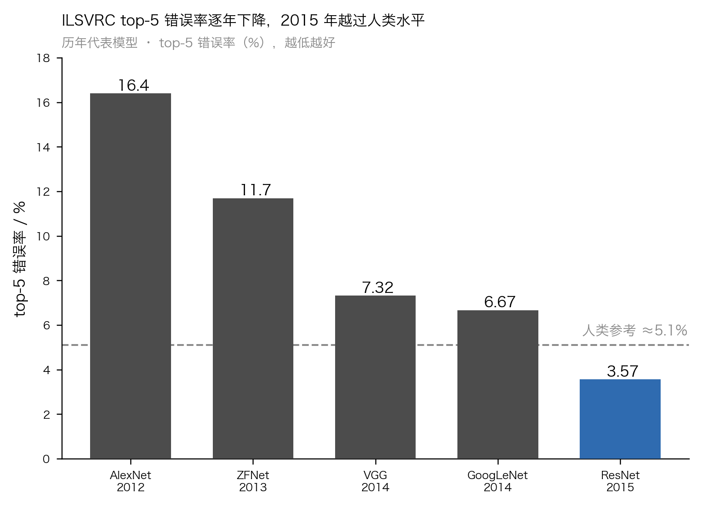
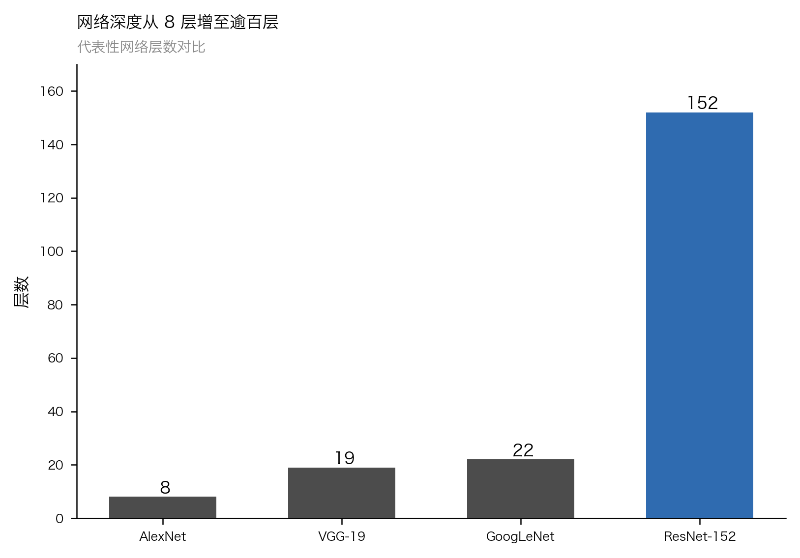

摘要

卷积神经网络（Convolutional Neural Network, CNN）是深度学习在计算机视觉领域的核心模型。本文回顾 CNN 的基本原理与代表性架构演进：从局部连接、权值共享与池化等归纳偏置出发，梳理由 LeNet 到 AlexNet、VGG、GoogLeNet 与 ResNet 的发展脉络，并结合 ILSVRC 公开赛果分析深度增加与错误率下降的关系。进而总结批归一化、Dropout、残差连接与数据增强等关键训练技术，讨论 CNN 在图像分类、检测与分割中的应用，最后指出模型效率、可解释性与在 Transformer 冲击下的定位等挑战。综述表明，结构先验与可训练性的持续改进，是 CNN 性能跃升的主线。

关键词：卷积神经网络；深度学习；计算机视觉；残差网络；图像分类

Abstract

The Convolutional Neural Network (CNN) is the core model of deep learning in computer vision. This paper reviews the fundamentals and representative architectures of CNNs, tracing the evolution from LeNet to AlexNet, VGG, GoogLeNet and ResNet, and analyses the relationship between increasing depth and decreasing error using public ILSVRC results. Key training techniques including batch normalization, dropout, residual connections and data augmentation are summarized, followed by applications in classification, detection and segmentation. Open challenges in efficiency, interpretability and the positioning of CNNs against Transformers are discussed.

Keywords: convolutional neural network; deep learning; computer vision; residual network; image classification

# 1 引言

计算机视觉的根本挑战，在于如何从高维、冗余且充满噪声的像素阵列中，提取出对平移、尺度与形变具有鲁棒性的语义特征。在深度学习兴起之前，主流范式是"人工设计特征算子加浅层分类器"，如尺度不变特征变换（Scale-Invariant Feature Transform, SIFT）配合支持向量机，其表达能力与泛化性受限于设计者的先验，难以随数据规模扩展。卷积神经网络（Convolutional Neural Network, CNN）通过端到端（end-to-end）学习分层特征，将特征提取与目标任务统一到同一个可微分框架内，从根本上改变了这一格局。

CNN 的思想可追溯至 20 世纪对生物视觉皮层感受野结构的研究，其现代雏形在 LeNet-5 中得以确立，并成功应用于手写数字识别[1]。然而，受限于当时的算力与标注数据规模，深度模型长期未能在复杂自然图像上展现优势。2012 年，AlexNet 在大规模图像识别挑战赛（ImageNet Large Scale Visual Recognition Challenge, ILSVRC）上以显著优势夺冠[2]，重新点燃了学界与工业界对深度学习的热情，此后 CNN 迅速成为视觉领域的主导范式。本文系统梳理 CNN 的基本原理、架构演进与关键训练技术，讨论其典型应用，并展望在效率、可解释性以及与 Transformer 融合等方向上的挑战。

# 2 CNN 基本原理

CNN 的有效性根植于三项针对图像数据引入的结构先验（归纳偏置）：局部连接、权值共享与下采样。它们在大幅压缩参数量的同时，赋予模型对局部模式的平移等变性，构成其区别于全连接网络的核心。

## 2.1 卷积、局部连接与权值共享

卷积层是 CNN 的计算核心。它以一组可学习的卷积核（滤波器）在输入特征图上滑动，在每个位置计算局部邻域的加权和并经非线性激活，从而响应边缘、角点、纹理等局部模式。这一机制体现了两条关键假设：其一为局部连接，即每个神经元只与输入的一个局部区域相连，反映了自然图像中"像素相关性随距离衰减"的统计规律；其二为权值共享，即同一卷积核在整幅特征图上复用同一组参数，使得在某一空间位置学到的特征检测器可自动迁移至其他位置，既大幅减少参数，又带来平移等变性。多个卷积核并行输出多个通道，逐层堆叠后，网络得以从低级视觉基元逐步组合出高级语义概念。

## 2.2 池化

池化（pooling）对特征图执行局部下采样，最常见的是取邻域最大值的最大池化。它在降低空间分辨率与后续计算量的同时，增强了模型对小幅平移与局部形变的不变性。需要区分的是，卷积提供平移等变性，而池化在此基础上进一步引入近似的平移不变性。近年来部分架构倾向以带步长的卷积替代显式池化，以在下采样过程中保留更多可学习的自由度。

## 2.3 激活函数

非线性激活函数是网络表达能力的来源；若无非线性，多层线性变换的叠加仍等价于单一线性映射。早期网络多采用 Sigmoid 或双曲正切函数，但其在饱和区梯度趋近于零，深层堆叠时易引发梯度消失。修正线性单元（Rectified Linear Unit, ReLU）在正半轴保持恒等、负半轴置零，计算简单且有效缓解了梯度消失，成为现代 CNN 的默认选择[3]。

## 2.4 感受野

感受野（receptive field）指输出特征图上某一神经元所对应的输入图像区域。随着卷积与池化层的堆叠，感受野逐层扩大，深层神经元得以"看到"更大范围的上下文，从而整合全局语义信息。感受野的增长方式深刻影响架构设计，例如以多个小卷积核堆叠等效替代大卷积核，正是在控制参数量的前提下高效扩大感受野的策略。

# 3 代表性架构演进

CNN 的性能跃升与网络深度的增加高度相关。如图 1，ILSVRC 冠军模型的 top-5 错误率[^1]在数年间从 AlexNet 的约 16.4% 降至 ResNet 的 3.57%，首次越过约 5.1% 的人类参考水平；图 2 显示同期代表性网络的深度从 8 层增长至逾百层，二者呈现清晰的协同关系。

图1 ILSVRC 历年冠军模型 top-5 错误率

图2 代表性网络深度对比

**LeNet-5** 确立了"卷积—池化—全连接"的经典范式，以约五个权值层实现了对手写数字的端到端识别，奠定了后续 CNN 的基本骨架[1]。**AlexNet** 将这一范式扩展至八层并成功训练于百万量级的自然图像，其关键在于以 ReLU 加速收敛、以 Dropout 抑制过拟合，并借助图形处理器（GPU）完成大规模并行训练[2]。**VGG** 系统性地论证了深度的价值：以多个 3×3 小卷积核堆叠替代大卷积核，可在相同感受野下加深网络、减少参数并引入更多非线性，其 16 至 19 层的规整结构成为特征提取的经典骨干[4]。

**GoogLeNet** 另辟蹊径，提出 Inception 模块，在同一层内并行不同尺度的卷积与池化分支，并以 1×1 卷积降维以控制计算量，从而在 22 层深度下实现了参数效率与多尺度表达的兼顾[5]。**ResNet** 则针对深度增加带来的退化问题给出根本性方案：通过残差连接（跳跃连接）令堆叠层学习相对于恒等映射的残差 $F(x)=H(x)-x$，使梯度得以直接回传，成功训练了 152 层乃至上千层的网络，将错误率进一步压至 3.57%[6]。**DenseNet** 将跳跃连接推向极致，在稠密块内令每一层都接收其前所有层的特征图作为输入，通过特征复用强化了梯度流动与参数效率，在更少参数下取得了有竞争力的性能[7]。

# 4 关键训练技术

架构创新之外，训练技术的进步同样是 CNN 走向实用的支柱。

**ReLU** 作为激活函数，以非饱和特性缓解了深层网络的梯度消失，显著加快了收敛速度[3]。**Dropout** 在训练时以一定概率随机置零神经元输出，等效于对指数级数量的子网络做集成，是抑制过拟合、提升泛化的有效正则化手段[8]。**批归一化（Batch Normalization, BN）** 对每个小批量内的层输入做规范化，缓解了训练过程中各层输入分布持续漂移的问题，从而允许更大的学习率、降低对初始化的敏感度并加速收敛，同时兼具轻微的正则化效果[9]。**残差连接**不仅是 ResNet 的架构要素，更是一项普适的训练技术：它为梯度提供了跨层的恒等捷径，从根本上改善了极深网络的可优化性[6]。**数据增强**通过随机翻转、裁剪、缩放与色彩扰动等变换，在不增加人工标注成本的前提下扩充训练样本的分布覆盖，是提升泛化、抑制过拟合的常规且有效的做法[2]。

# 5 典型应用

**图像分类**是 CNN 最先取得突破、也最为成熟的任务。ILSVRC 提供了统一的评测基准[10]，推动了前述架构的迭代；训练好的分类网络进而可作为通用视觉特征提取器，迁移至下游任务。

**目标检测**要求在分类之外定位物体的边界框。以区域卷积神经网络（Region-based CNN, R-CNN）为代表的两阶段方法先生成候选区域再逐一分类与回归，Faster R-CNN 进一步以区域建议网络将候选生成也纳入统一的可训练框架，大幅提升了精度与效率[11]。此类方法普遍以预训练的 CNN 作为骨干网络提取特征。

**语义分割**需为每个像素赋予类别标签。全卷积网络（Fully Convolutional Network, FCN）以卷积层替换分类网络末端的全连接层，实现了任意尺寸输入的端到端稠密预测[12]；U-Net 则以对称的编码器—解码器结构配合跨层跳跃连接，在医学影像等小样本场景下表现优异[13]。

# 6 挑战与展望

尽管成效显著，CNN 仍面临若干开放问题。其一是**效率与轻量化**：深层模型的参数量与计算开销大，难以直接部署于移动与嵌入式设备，因此模型压缩、量化、知识蒸馏与专为端侧设计的高效架构成为落地关键。其二是**可解释性**：CNN 的决策过程仍近乎黑箱，其特征归因与鲁棒性（如对对抗扰动的脆弱性）在医疗、自动驾驶等高风险场景中构成障碍，特征可视化与显著性归因是重要的研究方向。其三是**与 Transformer/ViT 的关系**：视觉 Transformer（Vision Transformer, ViT）将图像切分为图块序列并以自注意力建模全局依赖，在大规模数据上取得了超越同规模 CNN 的表现[14]，对纯卷积结构的主导地位形成冲击。然而卷积所携带的局部性与平移等变先验在数据有限时仍具优势，二者并非彼此替代：当前研究趋势是将卷积的归纳偏置与自注意力的全局建模能力相融合，或以现代化设计[^2]重新审视纯卷积架构的潜力。

# 7 结论

本文回顾了卷积神经网络的基本原理、架构演进、关键训练技术与典型应用。纵观其发展，一条清晰的主线贯穿始终：从局部连接、权值共享与池化所提供的结构先验出发，通过 ReLU、批归一化与残差连接等技术不断提升深层网络的可训练性，使得"以更深的网络学习更强的特征"这一路径得以持续兑现。CNN 不仅重塑了计算机视觉，也为整个深度学习领域提供了架构与训练方法论上的范本。面向未来，如何在效率、可解释性与表达能力之间取得平衡，以及如何在与自注意力机制的融合中扬长避短，将是视觉模型演进的核心议题；而"将有效的结构先验与更强的可训练性相结合"这一基本原则，仍将长期指引其发展。

[^1]: top-5 错误率指模型给出的置信度最高的 5 个类别中均不包含真实标签的样本比例，是 ILSVRC 分类任务的标准评价指标；文中约 5.1% 的人类参考水平引自 ILSVRC 组织方对人工标注误差的估计[10]。

[^2]: 此处"现代化设计"泛指借鉴 Transformer 训练策略与宏观结构（如更大卷积核、更少归一化层等）对纯卷积网络进行的重新设计，旨在说明卷积架构本身仍有优化空间，非特指某一具体模型。

# 参考文献

[1] LECUN Y, BOTTOU L, BENGIO Y, et al. Gradient-based learning applied to document recognition[J]. Proceedings of the IEEE, 1998, 86(11): 2278-2324.

[2] KRIZHEVSKY A, SUTSKEVER I, HINTON G E. ImageNet classification with deep convolutional neural networks[C]//Advances in Neural Information Processing Systems. 2012: 1097-1105.

[3] NAIR V, HINTON G E. Rectified linear units improve restricted Boltzmann machines[C]//Proceedings of the 27th International Conference on Machine Learning. 2010: 807-814.

[4] SIMONYAN K, ZISSERMAN A. Very deep convolutional networks for large-scale image recognition[C]//International Conference on Learning Representations. 2015.

[5] SZEGEDY C, LIU W, JIA Y, et al. Going deeper with convolutions[C]//IEEE Conference on Computer Vision and Pattern Recognition. 2015: 1-9.

[6] HE K, ZHANG X, REN S, et al. Deep residual learning for image recognition[C]//IEEE Conference on Computer Vision and Pattern Recognition. 2016: 770-778.

[7] HUANG G, LIU Z, VAN DER MAATEN L, et al. Densely connected convolutional networks[C]//IEEE Conference on Computer Vision and Pattern Recognition. 2017: 4700-4708.

[8] SRIVASTAVA N, HINTON G E, KRIZHEVSKY A, et al. Dropout: a simple way to prevent neural networks from overfitting[J]. Journal of Machine Learning Research, 2014, 15(1): 1929-1958.

[9] IOFFE S, SZEGEDY C. Batch normalization: accelerating deep network training by reducing internal covariate shift[C]//International Conference on Machine Learning. 2015: 448-456.

[10] RUSSAKOVSKY O, DENG J, SU H, et al. ImageNet large scale visual recognition challenge[J]. International Journal of Computer Vision, 2015, 115(3): 211-252.

[11] REN S, HE K, GIRSHICK R, et al. Faster R-CNN: towards real-time object detection with region proposal networks[C]//Advances in Neural Information Processing Systems. 2015: 91-99.

[12] LONG J, SHELHAMER E, DARRELL T. Fully convolutional networks for semantic segmentation[C]//IEEE Conference on Computer Vision and Pattern Recognition. 2015: 3431-3440.

[13] RONNEBERGER O, FISCHER P, BROX T. U-Net: convolutional networks for biomedical image segmentation[C]//Medical Image Computing and Computer-Assisted Intervention. 2015: 234-241.

[14] DOSOVITSKIY A, BEYER L, KOLESNIKOV A, et al. An image is worth 16×16 words: Transformers for image recognition at scale[C]//International Conference on Learning Representations. 2021.